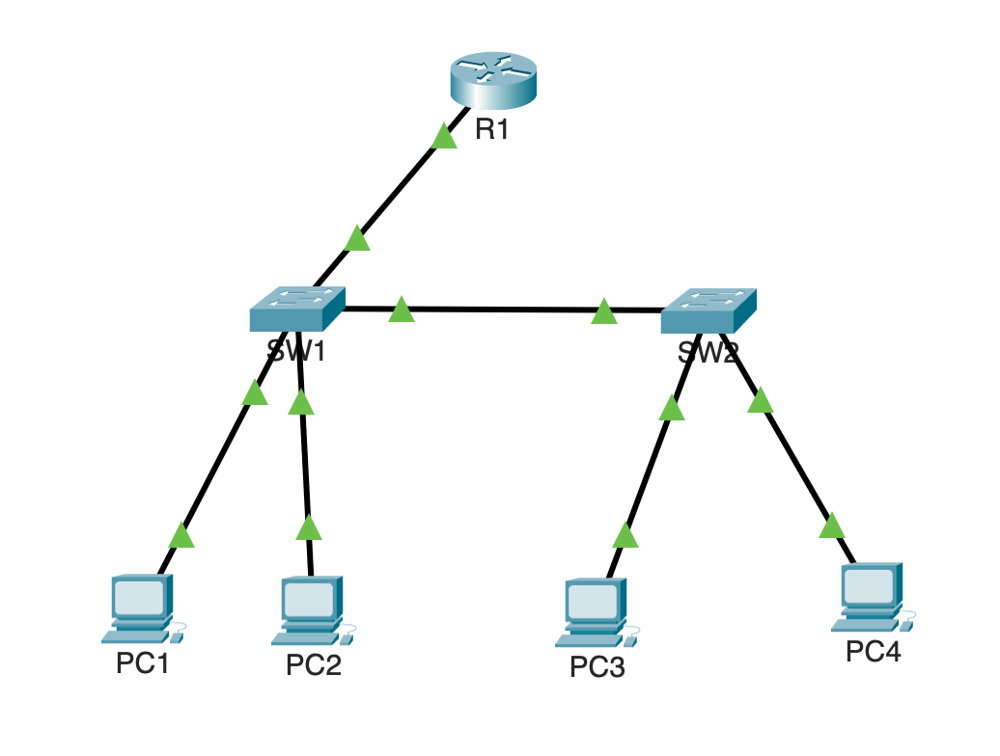

# Packet Tracer Lab — VLAN, Trunking & Inter-VLAN Routing
### Based on Jeremy's IT Lab (CCNA) — Days 8–18

A hands-on Cisco Packet Tracer lab covering subnetting, VLANs, trunking, DTP, VTP, and Router-on-a-Stick inter-VLAN routing.

---

## Topology



---

## Devices

| Device | Model | Role |
|--------|-------|------|
| R1 | Cisco 2911 | Router-on-a-Stick |
| SW1 | Cisco 2960 | VTP Server, trunk to R1 and SW2 |
| SW2 | Cisco 2960 | VTP Client, access ports to PC3/PC4 |
| PC1 | Generic PC | VLAN 10 — Sales |
| PC2 | Generic PC | VLAN 20 — HR |
| PC3 | Generic PC | VLAN 10 — Sales |
| PC4 | Generic PC | VLAN 20 — HR |

---

## Addressing Plan

| Device | Interface | VLAN | IP Address | Subnet Mask | Gateway |
|--------|-----------|------|------------|-------------|---------|
| R1 | G0/0.10 | 10 | 192.168.1.1 | 255.255.255.192 | — |
| R1 | G0/0.20 | 20 | 192.168.1.65 | 255.255.255.192 | — |
| PC1 | NIC | 10 | 192.168.1.2 | 255.255.255.192 | 192.168.1.1 |
| PC2 | NIC | 20 | 192.168.1.66 | 255.255.255.192 | 192.168.1.65 |
| PC3 | NIC | 10 | 192.168.1.3 | 255.255.255.192 | 192.168.1.1 |
| PC4 | NIC | 20 | 192.168.1.67 | 255.255.255.192 | 192.168.1.65 |

### Subnet Breakdown

| VLAN | Name | Network | Usable Range | Broadcast |
|------|------|---------|--------------|-----------|
| 10 | SALES | 192.168.1.0/26 | .1 – .62 | .63 |
| 20 | HR | 192.168.1.64/26 | .65 – .126 | .127 |

---

## Cable Connections

| From | To | Cable Type |
|------|----|-----------|
| R1 G0/0 | SW1 G0/1 | Straight-through |
| SW1 G0/2 | SW2 G0/1 | Straight-through |
| SW1 F0/1 | PC1 NIC | Straight-through |
| SW1 F0/2 | PC2 NIC | Straight-through |
| SW2 F0/1 | PC3 NIC | Straight-through |
| SW2 F0/2 | PC4 NIC | Straight-through |

---

## CLI Configurations

### SW1 — VTP Server, VLANs, Trunking, Access Ports

```
Switch> enable
Switch# configure terminal
Switch(config)# hostname SW1

! VTP
SW1(config)# vtp mode server
SW1(config)# vtp domain CCNA-LAB
SW1(config)# vtp password cisco

! VLANs
SW1(config)# vlan 10
SW1(config-vlan)# name SALES
SW1(config)# vlan 20
SW1(config-vlan)# name HR
SW1(config-vlan)# exit

! Trunk toward R1
SW1(config)# interface g0/1
SW1(config-if)# switchport mode trunk
SW1(config-if)# switchport trunk allowed vlan 10,20
SW1(config-if)# exit

! Trunk toward SW2 (DTP active)
SW1(config)# interface g0/2
SW1(config-if)# switchport mode dynamic desirable
SW1(config-if)# exit

! Access port — PC1 (VLAN 10)
SW1(config)# interface f0/1
SW1(config-if)# switchport mode access
SW1(config-if)# switchport access vlan 10
SW1(config-if)# exit

! Access port — PC2 (VLAN 20)
SW1(config)# interface f0/2
SW1(config-if)# switchport mode access
SW1(config-if)# switchport access vlan 20
SW1(config-if)# exit

SW1(config)# exit
SW1# write memory
```

---

### SW2 — VTP Client, DTP, Access Ports

```
Switch> enable
Switch# configure terminal
Switch(config)# hostname SW2

! VTP
SW2(config)# vtp mode client
SW2(config)# vtp domain CCNA-LAB
SW2(config)# vtp password cisco

! Trunk toward SW1 (DTP passive — negotiates trunk with SW1)
SW2(config)# interface g0/1
SW2(config-if)# switchport mode dynamic auto
SW2(config-if)# exit

! Access port — PC3 (VLAN 10)
SW2(config)# interface f0/1
SW2(config-if)# switchport mode access
SW2(config-if)# switchport access vlan 10
SW2(config-if)# exit

! Access port — PC4 (VLAN 20)
SW2(config)# interface f0/2
SW2(config-if)# switchport mode access
SW2(config-if)# switchport access vlan 20
SW2(config-if)# exit

SW2(config)# exit
SW2# write memory
```

---

### R1 — Router-on-a-Stick

```
Router> enable
Router# configure terminal
Router(config)# hostname R1

! Bring up physical interface
R1(config)# interface g0/0
R1(config-if)# no shutdown
R1(config-if)# exit

! Sub-interface for VLAN 10
R1(config)# interface g0/0.10
R1(config-subif)# encapsulation dot1Q 10
R1(config-subif)# ip address 192.168.1.1 255.255.255.192
R1(config-subif)# exit

! Sub-interface for VLAN 20
R1(config)# interface g0/0.20
R1(config-subif)# encapsulation dot1Q 20
R1(config-subif)# ip address 192.168.1.65 255.255.255.192
R1(config-subif)# exit

R1(config)# exit
R1# write memory
```

---

## Verification Commands

### On SW1 and SW2
```
show vlan brief
show interfaces trunk
show vtp status
```

### On R1
```
show ip interface brief
```

### Ping Tests from PC1
```
ping 192.168.1.3     ! PC1 → PC3 (same VLAN, different switch)
ping 192.168.1.66    ! PC1 → PC2 (inter-VLAN routing)
ping 192.168.1.67    ! PC1 → PC4 (inter-VLAN, different switch)
```

---

## Expected Results

| Test | Result | Notes |
|------|--------|-------|
| PC1 → PC3 | ✅ 4/4 packets | Same VLAN, switches only, TTL 128 |
| PC1 → PC2 | ✅ 3/4 packets | First packet lost to ARP, TTL 127 |
| PC1 → PC4 | ✅ 3/4 packets | First packet lost to ARP, TTL 127 |

TTL 128 confirms traffic stayed on the switch (no routing). TTL 127 confirms traffic was routed through R1 (one hop decrement).

---

## Concepts Covered

| Topic | Jeremy's IT Lab |
|-------|----------------|
| Subnetting & VLSM | Day 8–14 |
| Static Routing | Day 15 |
| VLANs & Trunking | Day 16–17 |
| Router-on-a-Stick | Day 17 |
| DTP & VTP | Day 18 |

---

## Troubleshooting Notes

- **ISR4331 does not support `encapsulation dot1Q`** in Packet Tracer — use the 2911 instead
- **First ping timeout** on inter-VLAN tests is expected — ARP resolution on the first packet
- **Orange port lights** on switch access ports at startup are normal — STP convergence takes 30–50 seconds
- **VTP client will not learn VLANs** if the domain name or password does not match the server exactly

---

## References

- [Jeremy's IT Lab — Free CCNA Course](https://www.jeremysitlab.com)
- Cisco IOS Command Reference
